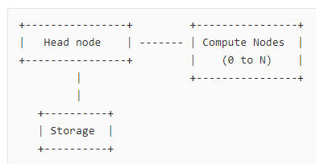
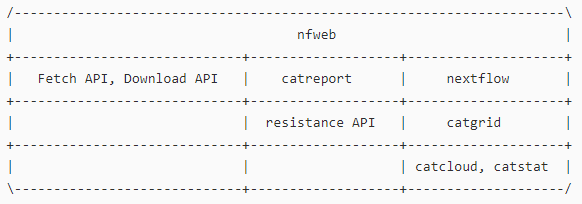

Architecture
============

Cloud Infrastructure
--------------------

Head Node
---------

Persistence Storage
-------------------

.. image:: _static/persistence.png

The persistent store presents a landing page listing all SP3 cloud instances. From there the user can choose one to run their analysis on or view details of the runs or reports from any cloud instance or download run output files.

Each cloud instance has a instance configuration file containing its name, id and associated persistent store.

Periodically cloud instances copy their databases, reports, output files to the persistent store.