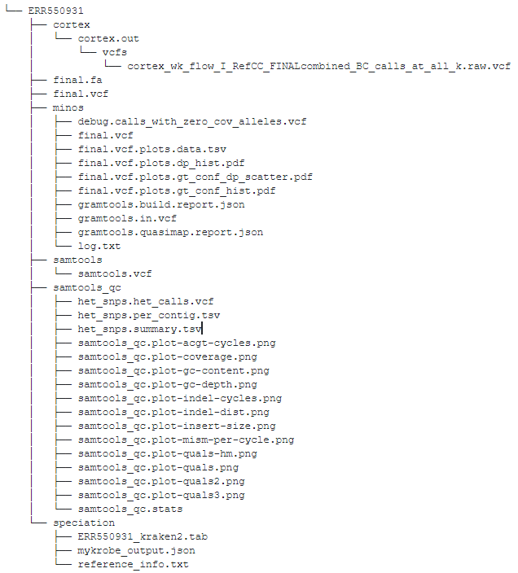
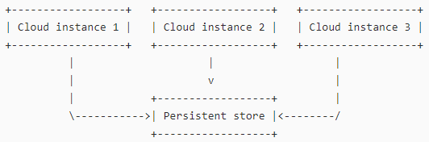

Data Types
==========

Cats software
-------------

+----------------------------+-------------------------+-------+
| directory/file             | contents                | owner |
+============================+=========================+=======+
| ~/sp3/catcloud             | catcloud                | user  |
+----------------------------+-------------------------+-------+
| ~/sp3/catgrid              | catgrid                 | user  |
+----------------------------+-------------------------+-------+
| ~/sp3/catreport            | catreport               | user  |
+----------------------------+-------------------------+-------+
| ~/sp3/catstat              | catstat                 | user  |
+----------------------------+-------------------------+-------+
| ~/sp3/catweb               | catweb                  | user  |
+----------------------------+-------------------------+-------+
| ~/sp3/catweb/config.yaml.d | catweb pipeline configs | user  |
+----------------------------+-------------------------+-------+
| ~/sp3/cattag/              | cattag                  | user  |
+----------------------------+-------------------------+-------+
| ~/sp3/downloadapi          | downloadapi             | user  |
+----------------------------+-------------------------+-------+
| ~/sp3/fetchapi             | fetchapi                | user  |
+----------------------------+-------------------------+-------+
| ~/sp3/resistance           | resistance              | user  |
+----------------------------+-------------------------+-------+

Static Data
-----------

+-----------------------------------------+-------------------------+---------------+-----------------------------------------------------+
| directory/file                          | contents                | owner         |               Notes                                 |
+=========================================+=========================+===============+=====================================================+
| /data/images                            | container images        | root          |One pipeline could have one or more container images |
+-----------------------------------------+-------------------------+---------------+-----------------------------------------------------+
| /data/pipelines                         | nextflow pipelines      | root          |Pipeline software, source controlled in Git          |
+-----------------------------------------+-------------------------+---------------+-----------------------------------------------------+
| /data/references                        | reference data          | root          |Genome references, Taxonomic classification databases|
+-----------------------------------------+-------------------------+---------------+-----------------------------------------------------+
| /data/reports/resistance/data           | resistance data         | root          |Genbank file, resistance catalog etc.                |
+-----------------------------------------+-------------------------+---------------+-----------------------------------------------------+
| /data/fetch                             | fetch api data          | fetch api     |Data fetched to Cloud from ENA                       |
+-----------------------------------------+-------------------------+---------------+-----------------------------------------------------+
| /data/inputs                            | fetch api symlinks      | fetch api     |Data fetched to Cloud by SFTP                        |
+-----------------------------------------+-------------------------+---------------+-----------------------------------------------------+

Dynamic Data
------------

+-----------------------------------------+-------------------------+---------------+
| directory/file                          | contents                | owner         |
+=========================================+=========================+===============+
| /work/runs                              | pipeline runs           | nextflow      |
+-----------------------------------------+-------------------------+---------------+
| /work/output                            | pipeline outputs        | nextflow      |
+-----------------------------------------+-------------------------+---------------+
| /work/reports/catreport/reports         | report files            | catreport     |
+-----------------------------------------+-------------------------+---------------+
| /work/reports/resistanceapi/vcfs        | resistanceapi temp      | resistanceapi |
+-----------------------------------------+-------------------------+---------------+
| /work/logs/reports/resistanceapi        | resistanceapi logs      | resistanceapi |
+-----------------------------------------+-------------------------+---------------+
| /work/logs/fetchapi*                    | fetchapi logs           | fetchapi      |
+-----------------------------------------+-------------------------+---------------+
| /work/logs/catweb*                      | catweb logs             | catweb        |
+-----------------------------------------+-------------------------+---------------+

Audit Trail Data
----------------

+----------------------+--------------------------+-----------+
| directory/file       | contents                 | owner     |
+======================+==========================+===========+
| /db/catweb.sqlite    | nextflow runs  etc.      | catweb    |
+----------------------+--------------------------+-----------+
| /db/catreport.sqlite | report files and path    | catreport |
+----------------------+--------------------------+-----------+
| /db/fetch-api.sqlite | fetch queues and datasets| fetch-api |
+----------------------+--------------------------+-----------+

**SP3 Nextflow run audit trail example - one run**

.. code-block:: JSON

    {
    "run_uuid": "aab17656-bc1f-498f-a292-55ead738f798", 
    "run_name": "nfNVM-20191106_210109_ignoreError", 
    "context": "local", 
    "reference_map": "{}", 
    "user_param_dict":{
        "--rawDataDir": "/data/inputs/local/5b1a38fe-dae1-4a18-bcee-d02c80d2cd83", 
        "--readpat": "*.fastq.gz", 
        "--Porechop": "false"}, 
    "user_name": "fan@ndm.local", 
    "indir": "/data/inputs/local/5b1a38fe-dae1-4a18-bcee-d02c80d2cd83", 
    "readpat": "*.fastq.gz", 
    "nfweb_git_version": "718231e", 
    "flow_git_version": "32442cd"
    }

**SP3 online report audit trail example - one section of report**

.. code-block:: JSON

    {
    "uuid" : "7b6da105-96a1-4f29-8b0e-d1e59f64a9f3",
    "type" : "samtools_qc",
    "status" : "done",
    "added_epochtime" : "1571230370",
    "started_epochtime" : "1571230371",
    "finished_epochtime" : "1571230371",
    "pipeline_run_uuid" : "e0c27438-5453-4af6-9b64-15470b2fafbc",
    "sample_name" : "SRR3675209",
    "sample_filepath" : "/work/output/e0c27438-5453-4af6-9b64-15470b2fafbc/SRR3675209/samtools_qc/samtools_qc.stats",
    "report_filename" : "/work/reports/catreport/reports/7b6da105-96a1-4f29-8b0e-d1e59f64a9f3.json",
    "software_versions" : {
        "nfweb_git_version": "718231e", 
        "flow_git_version": "g3541843"} 
    }

**Data fetch from ENA audit trail example - one ENA fetch**

.. code-block:: JSON

    {
    "fetch_type": "all", 
    "fetch_rerun": "false", 
    "fetch_range": "", 
    "bad_files": [], 
    "ok_files_fastq_ftp": [
        "ftp.sra.ebi.ac.uk/vol1/fastq/SRR367/005/SRR3675245/SRR3675245_1.fastq.gz", 
        "ftp.sra.ebi.ac.uk/vol1/fastq/SRR367/005/SRR3675245/SRR3675245_2.fastq.gz"], 
    "ok_files_fastq_md5": [
        "8902e3eae2a5bb0006f8f36fe8117d21", 
        "bd3635fb61800e6a9849bcef05fe12ef"], 
    "ok_files_len": 2, 
    "bad_files_len": 0, 
    "failed_download_files": [], 
    "ok_download_files": [
        "ftp.sra.ebi.ac.uk/vol1/fastq/SRR367/005/SRR3675245/SRR3675245_1.fastq.gz", 
        "ftp.sra.ebi.ac.uk/vol1/fastq/SRR367/005/SRR3675245/SRR3675245_2.fastq.gz"]
    }

Clockwork Pipeline Output Data
------------------------------

Clockwork Reporting Data
------------------------

+-------------------------+-------------------------+-----------------+
| Process                 | Files                   | Notes           |
+=========================+=========================+=================+
| Kraken2                 | ERR550931_kraken2.tab   | reported        |
+-------------------------+-------------------------+-----------------+
| Mykrobe                 | mykrobe_output.json     | reported        |
+-------------------------+-------------------------+-----------------+
| Reference               | reference_info.txt      | reported        |
+-------------------------+-------------------------+-----------------+
| Samtool QC              | samtools_qc.stats       | reported        |
+-------------------------+-------------------------+-----------------+
| Resistance              | final.vcf               | reported        |
+-------------------------+-------------------------+-----------------+

Data Storage
------------

**Ephemeral**

Ephemeral data are available when the cloud instance is running and the run has not been deleted from the cloud instance, such as dynamic data, output data.

**Short-term**

Pipeline input data (fastq or bam) are available on Cloud for a short period of time, say 2 weeks to 2 months based on the capacity of the platform.

Pipeline output data (e.g. Clockwork TB pipeline output) will be available for short-term, say 2 weeks to 2 months based on the capacity of the platform.

**Persistent**

Persistent data are needed to be available without cloud instance running, which should be stored in a dedicated storage, such as static data, audit trail data, reporting data.

**Long-term**

Persistent data can be available for long-term access based on user wish and cost of storage. 

Persistence Storage
-------------------

Each cloud instance has a instance configuration file containing its name, id and associated persistent store.

Periodically cloud instances copy their databases, reports, output files to the persistent store.