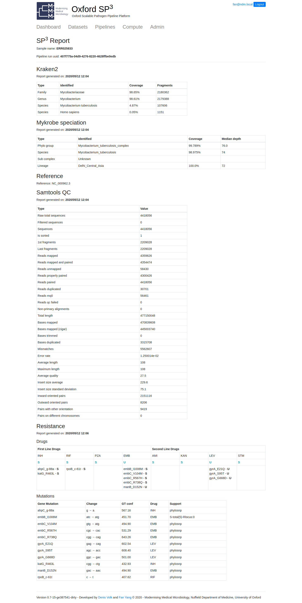

Data Types
==========

Cats Software
-------------

+----------------------------+-------------------------+-------+
| directory/file             | contents                | owner |
+============================+=========================+=======+
| ~/sp3/catcloud             | catcloud                | user  |
+----------------------------+-------------------------+-------+
| ~/sp3/catgrid              | catgrid                 | user  |
+----------------------------+-------------------------+-------+
| ~/sp3/catreport            | catreport               | user  |
+----------------------------+-------------------------+-------+
| ~/sp3/catstat              | catstat                 | user  |
+----------------------------+-------------------------+-------+
| ~/sp3/catweb               | catweb                  | user  |
+----------------------------+-------------------------+-------+
| ~/sp3/catweb/config.yaml.d | catweb pipeline configs | user  |
+----------------------------+-------------------------+-------+
| ~/sp3/cattag/              | cattag                  | user  |
+----------------------------+-------------------------+-------+
| ~/sp3/downloadapi          | downloadapi             | user  |
+----------------------------+-------------------------+-------+
| ~/sp3/fetchapi             | fetchapi                | user  |
+----------------------------+-------------------------+-------+
| ~/sp3/resistance           | resistance              | user  |
+----------------------------+-------------------------+-------+

Static Data
-----------

+-----------------------------------------+-------------------------+---------------+-----------------------------------------------------+
| directory/file                          | contents                | owner         |               Notes                                 |
+=========================================+=========================+===============+=====================================================+
| /data/images                            | container images        | root          |One pipeline could have one or more container images |
+-----------------------------------------+-------------------------+---------------+-----------------------------------------------------+
| /data/pipelines                         | nextflow pipelines      | root          |Pipeline software, source controlled in Git          |
+-----------------------------------------+-------------------------+---------------+-----------------------------------------------------+
| /data/references                        | reference data          | root          |Genome references, Taxonomic classification databases|
+-----------------------------------------+-------------------------+---------------+-----------------------------------------------------+
| /data/reports/resistance/data           | resistance data         | root          |Genbank file, resistance catalog etc.                |
+-----------------------------------------+-------------------------+---------------+-----------------------------------------------------+
| /data/fetch                             | fetch api data          | fetch api     |Data fetched to Cloud from ENA                       |
+-----------------------------------------+-------------------------+---------------+-----------------------------------------------------+
| /data/inputs                            | fetch api symlinks      | fetch api     |Data fetched to Cloud by SFTP                        |
+-----------------------------------------+-------------------------+---------------+-----------------------------------------------------+

Dynamic Data
------------

+-----------------------------------------+-------------------------+---------------+
| directory/file                          | contents                | owner         |
+=========================================+=========================+===============+
| /work/runs                              | pipeline runs           | nextflow      |
+-----------------------------------------+-------------------------+---------------+
| /work/output                            | pipeline outputs        | nextflow      |
+-----------------------------------------+-------------------------+---------------+
| /work/reports/catreport/reports         | report files            | catreport     |
+-----------------------------------------+-------------------------+---------------+
| /work/reports/resistanceapi/vcfs        | resistanceapi temp      | resistanceapi |
+-----------------------------------------+-------------------------+---------------+
| /work/logs/reports/resistanceapi        | resistanceapi logs      | resistanceapi |
+-----------------------------------------+-------------------------+---------------+
| /work/logs/fetchapi*                    | fetchapi logs           | fetchapi      |
+-----------------------------------------+-------------------------+---------------+
| /work/logs/catweb*                      | catweb logs             | catweb        |
+-----------------------------------------+-------------------------+---------------+

Audit Trail Data
----------------

+----------------------+--------------------------+-----------+
| directory/file       | contents                 | owner     |
+======================+==========================+===========+
| /db/catweb.sqlite    | nextflow runs  etc.      | catweb    |
+----------------------+--------------------------+-----------+
| /db/catreport.sqlite | report files and path    | catreport |
+----------------------+--------------------------+-----------+
| /db/fetch-api.sqlite | fetch queues and datasets| fetch-api |
+----------------------+--------------------------+-----------+

**SP3 Nextflow run audit trail example - one run**

.. code-block:: JSON

    {
    "run_uuid": "aab17656-bc1f-498f-a292-55ead738f798", 
    "run_name": "nfNVM-20191106_210109_ignoreError", 
    "context": "local", 
    "reference_map": "{}", 
    "user_param_dict":{
        "--rawDataDir": "/data/inputs/local/5b1a38fe-dae1-4a18-bcee-d02c80d2cd83", 
        "--readpat": "*.fastq.gz", 
        "--Porechop": "false"}, 
    "user_name": "fan@ndm.local", 
    "indir": "/data/inputs/local/5b1a38fe-dae1-4a18-bcee-d02c80d2cd83", 
    "readpat": "*.fastq.gz", 
    "nfweb_git_version": "718231e", 
    "flow_git_version": "32442cd"
    }

**SP3 online report audit trail example - one section of report**

.. code-block:: JSON

    {
    "uuid" : "7b6da105-96a1-4f29-8b0e-d1e59f64a9f3",
    "type" : "samtools_qc",
    "status" : "done",
    "added_epochtime" : "1571230370",
    "started_epochtime" : "1571230371",
    "finished_epochtime" : "1571230371",
    "pipeline_run_uuid" : "e0c27438-5453-4af6-9b64-15470b2fafbc",
    "sample_name" : "SRR3675209",
    "sample_filepath" : "/work/output/e0c27438-5453-4af6-9b64-15470b2fafbc/SRR3675209/samtools_qc/samtools_qc.stats",
    "report_filename" : "/work/reports/catreport/reports/7b6da105-96a1-4f29-8b0e-d1e59f64a9f3.json",
    "software_versions" : {
        "nfweb_git_version": "718231e", 
        "flow_git_version": "g3541843"} 
    }

**Data fetch from ENA audit trail example - one ENA fetch**

.. code-block:: JSON

    {
    "fetch_type": "all", 
    "fetch_rerun": "false", 
    "fetch_range": "", 
    "bad_files": [], 
    "ok_files_fastq_ftp": [
        "ftp.sra.ebi.ac.uk/vol1/fastq/SRR367/005/SRR3675245/SRR3675245_1.fastq.gz", 
        "ftp.sra.ebi.ac.uk/vol1/fastq/SRR367/005/SRR3675245/SRR3675245_2.fastq.gz"], 
    "ok_files_fastq_md5": [
        "8902e3eae2a5bb0006f8f36fe8117d21", 
        "bd3635fb61800e6a9849bcef05fe12ef"], 
    "ok_files_len": 2, 
    "bad_files_len": 0, 
    "failed_download_files": [], 
    "ok_download_files": [
        "ftp.sra.ebi.ac.uk/vol1/fastq/SRR367/005/SRR3675245/SRR3675245_1.fastq.gz", 
        "ftp.sra.ebi.ac.uk/vol1/fastq/SRR367/005/SRR3675245/SRR3675245_2.fastq.gz"]
    }

Clockwork Output for Download
-----------------------------

.. code-block:: bash

    /work/output/407f775a-04d9-4276-8220-4628ffbe0edb
    8 directories, 26 files
    Total size: 791M

    └── ERR025833
        ├── cortex
        │   └── cortex.out
        │       └── vcfs
        │           └── cortex_wk_flow_I_RefCC_FINALcombined_BC_calls_at_all_k.raw.vcf
        ├── minos
        │   ├── final.vcf
        │   ├── gvcf.fasta
        │   ├── gvcf.samtools.vcf
        │   └── gvcf.vcf.gz
        ├── samtools
        │   ├── rmdup.bam
        │   └── samtools.vcf
        ├── samtools_qc
        │   ├── het_snps.het_calls.vcf
        │   ├── het_snps.per_contig.tsv
        │   ├── het_snps.summary.tsv
        │   ├── samtools_qc.plot-acgt-cycles.png
        │   ├── samtools_qc.plot-coverage.png
        │   ├── samtools_qc.plot-gc-content.png
        │   ├── samtools_qc.plot-gc-depth.png
        │   ├── samtools_qc.plot-indel-cycles.png
        │   ├── samtools_qc.plot-indel-dist.png
        │   ├── samtools_qc.plot-insert-size.png
        │   ├── samtools_qc.plot-mism-per-cycle.png
        │   ├── samtools_qc.plot-quals-hm.png
        │   ├── samtools_qc.plot-quals.png
        │   ├── samtools_qc.plot-quals2.png
        │   ├── samtools_qc.plot-quals3.png
        │   └── samtools_qc.stats
        └── speciation
            ├── ERR025833_kraken2.tab
            ├── mykrobe_output.json
            └── reference_info.txt

Clockwork Report
----------------

**data behind the report**

+-------------------------+-------------------------+-----------------+
| Process                 | Files                   | Notes           |
+=========================+=========================+=================+
| Kraken2                 | ERR550931_kraken2.tab   | reported        |
+-------------------------+-------------------------+-----------------+
| Mykrobe                 | mykrobe_output.json     | reported        |
+-------------------------+-------------------------+-----------------+
| Reference               | reference_info.txt      | reported        |
+-------------------------+-------------------------+-----------------+
| Samtool QC              | samtools_qc.stats       | reported        |
+-------------------------+-------------------------+-----------------+
| Resistance              | final.vcf               | reported        |
+-------------------------+-------------------------+-----------------+

Clockwork Output in Persisent Storage
-------------------------------------

.. code-block:: bash

    └── ERR025833
        ├── cortex
        │   └── cortex.out
        │       └── vcfs
        ├── minos
        │   ├── final.vcf
        │   └── gvcf.fasta
        ├── samtools
        ├── samtools_qc
        │   └── samtools_qc.stats
        └── speciation
            ├── ERR025833_kraken2.tab
            ├── mykrobe_output.json
            └── reference_info.txt

