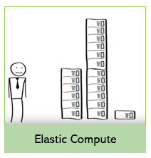
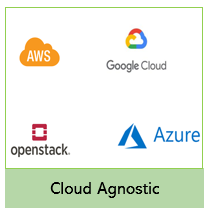

Design
======

Elastic Computing
-----------------

SP3 scales the resources on demand. When there is no task, the resources (compute nodes) will be deallocated and when there are requests for running one or more bioinformatic pipelines, the platform will allocate resources based on the pipeline CPU and memory requirements.

Cloud Agnostic
--------------

SP3 has a unified execution layer of abstraction for users over cloud based infrastructure, eliminating the need for provider-specific cluster management. The ability can be realized on Google Cloud Platform (GCP), Amazon Elastic Computing Cloud (Amazon EC2), Azure and Openstack.

Plug and Play Pipelines
-----------------------

SP3 promotes portability and scalability of bioinformatic pipeline development. It supports any bioinformatic pipeline developed using Nextflow paired with container technology, such as Docker or Singularity. It allows users to configure the bioinformatic pipeline using declarative configuration via a YAML formatted file. The configuration file describes how the pipelines should run, such as the input and output parameters and the scripts.

Connect to ENA Repo
-------------------

SP3 built-in support to fetch data from ENA to the execution platform. After fetch, the user can choose one of the pipelines to run against the dataset. The fetched data persists for a period of time, allowing users to run different pipelines, and then deleted after all the analyses have been performed. The fetch API is modular and extendable, which allow developers to fetch data from other data sources.
