.. _sp3-features:

SP3 Features
============

If you have started your journey with SP3, here is a list of SP3 features for you to explore more.

The following image gives you an example of a Run detail view, (you can get to this view from Dashboard or Pipeline view, clicking detail link of a run.)

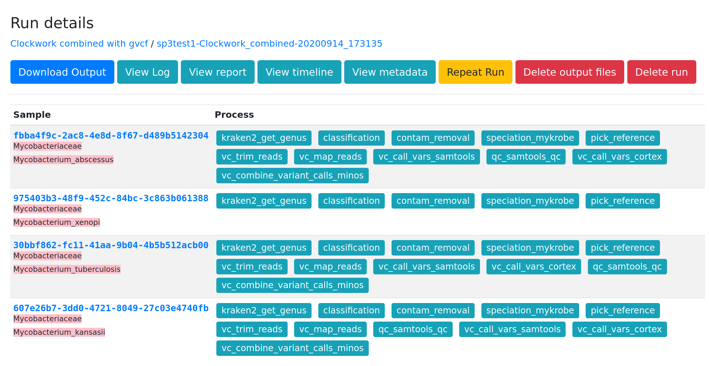

At the top of this run detail view, it shows:

- The pipeline name: **Clockwork combined with gvcf** and then
- The run name: **sp3test1-Clockwork_combined-20200914_173135**

(The run name is generated for you (with pipeline name and timestamp), and you can edit it as well when starting a new run)

Speciation
----------

Looking at the run detail view, a table of samples and processes of samples are presented for you.

In this run, there are 4 samples. In column **"Sample"**, you will see sample name (or guid if uploaded using Catsup as this run) and what species the sample has been identified by Kraken2.

In this run, the species of the samples are **abscessus**, **xenopi**, **tuberculosis** and **kansasii** as highlighted under sample guid (or name).

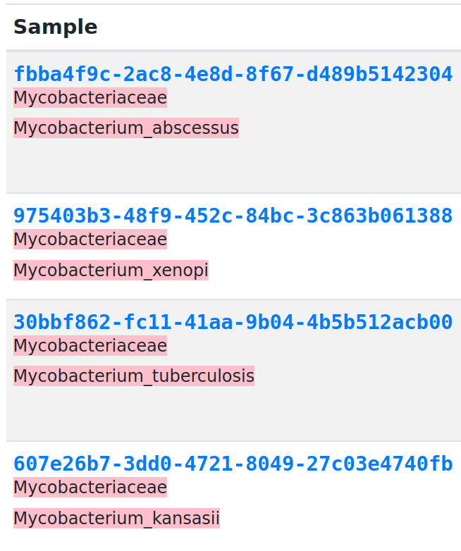

SP3 TB pipeline (clockwork combined) provides speciation information using **kraken2** and **mykrobe**. The highlighted speciation information is result of kraken2.

Both kraken2 and mykrobe detail output can be viewed in SP3 report by clicking the sample name/guid.

In the report (shown below), you can also see the reference as a result of mykrobe the pipeline has used to map the sample to for variant calling. For example, we map abscessus to NC_010397.1.

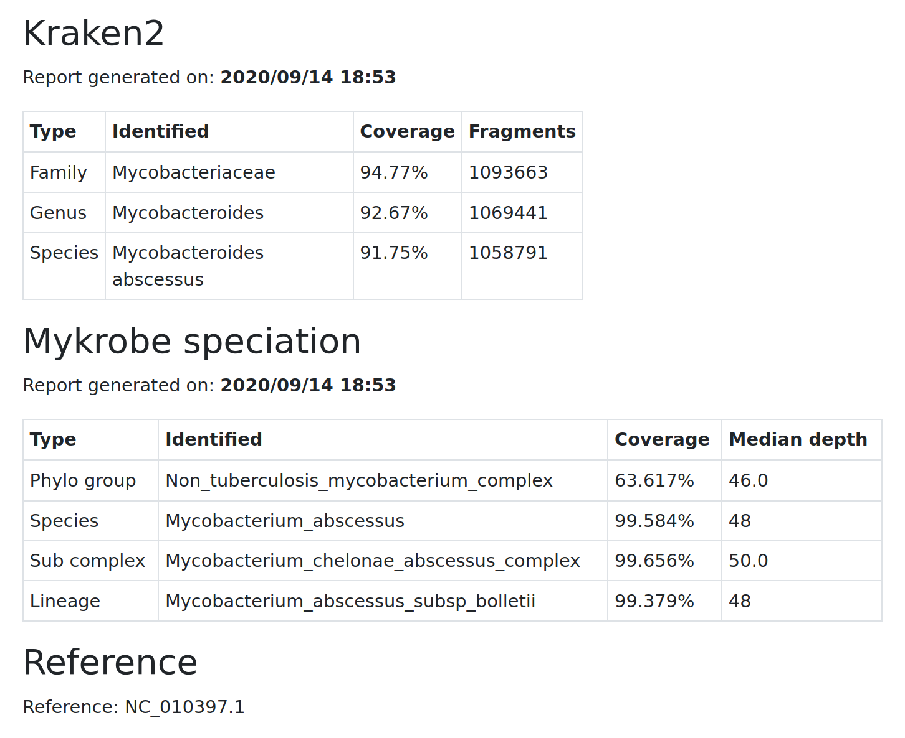

Processes/Tasks
---------------

In the column of **"Processes"**, a list of processes/tasks are presented. If the task is successfully run, the task will be highlighted as Green as shown here. If it failed, it will be shown as red.
The detail of each process can be viewed by clicking the task name, such as vc_combine_variant_calls_minos.

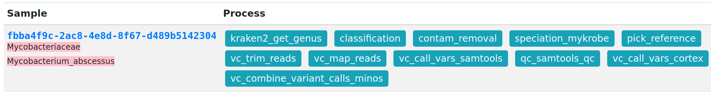

An example of task detail view is shown below.

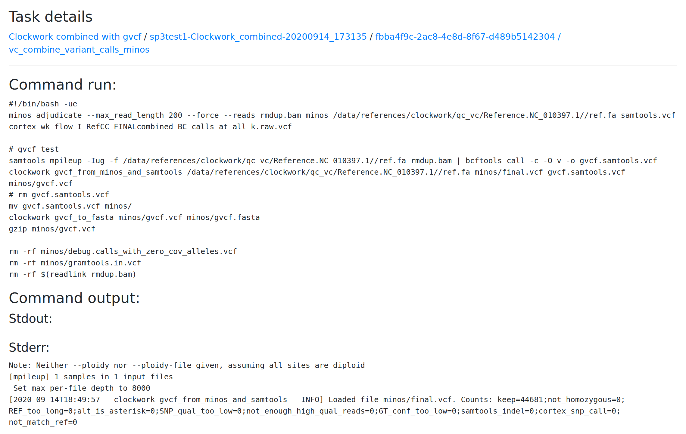

And you can click the bottons on the page to get to the following features: 

View log 
--------
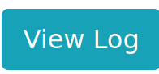

Log view presents command&parameters, inputs and outputs etc.

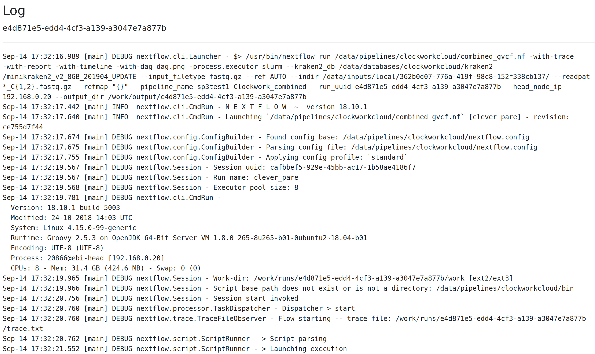

View (Nextflow) report
----------------------

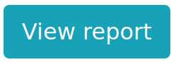

Nextflow report view shows CPU, Memory, IO usage etc.  

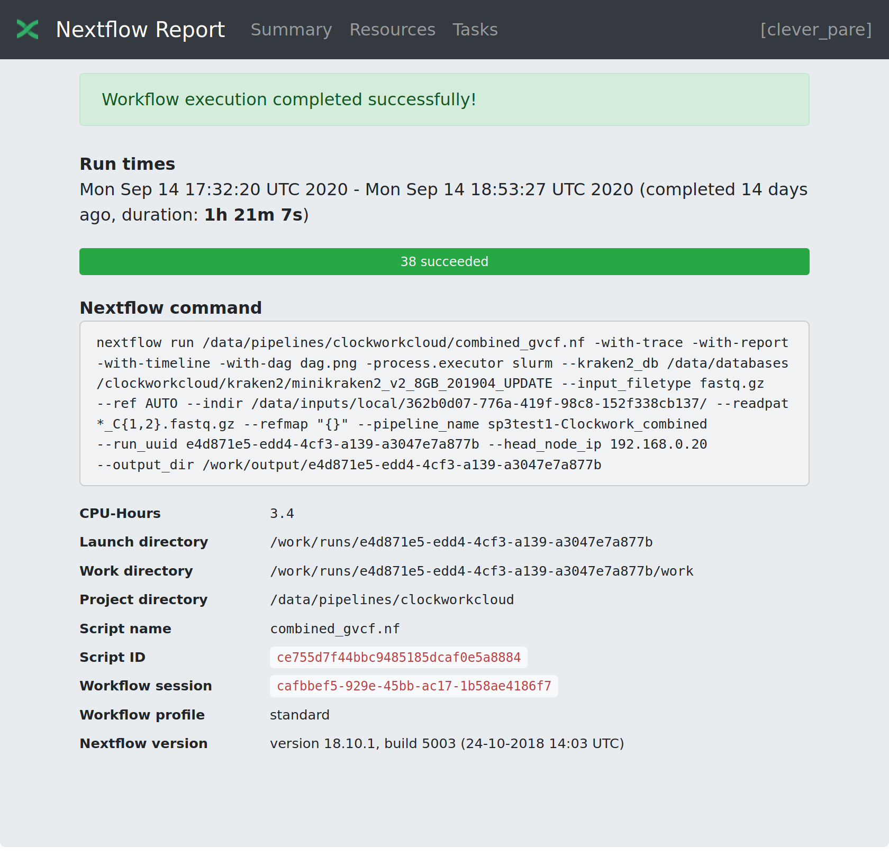
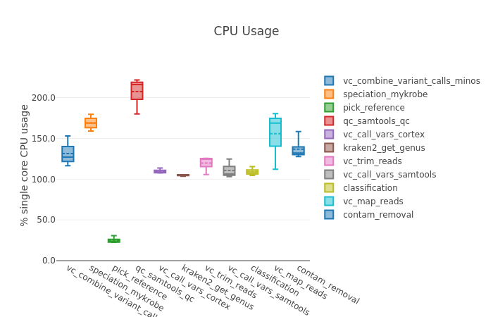
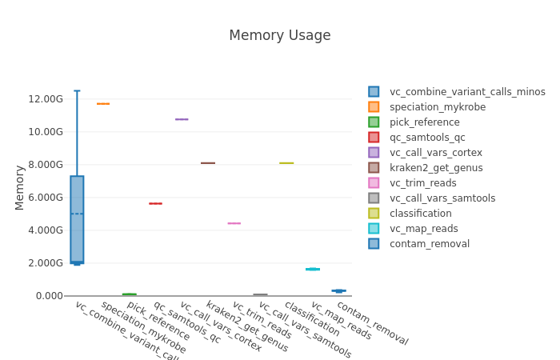

View timeline
-------------
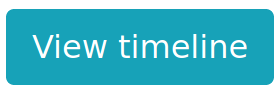

Nextflow timeline view provides time spent on each process.

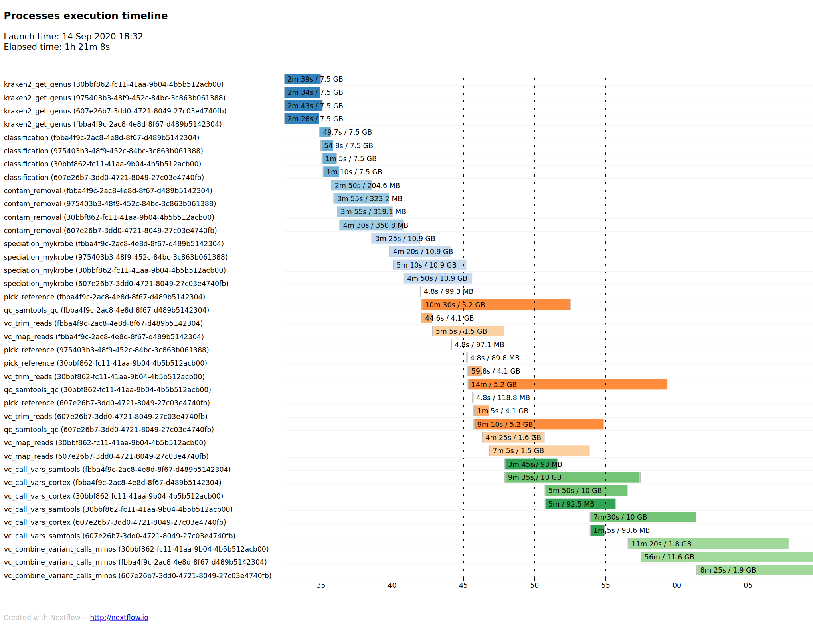

View metadata
-------------

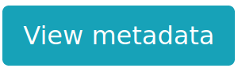

If you use Catsup upload, metadata is shown here.

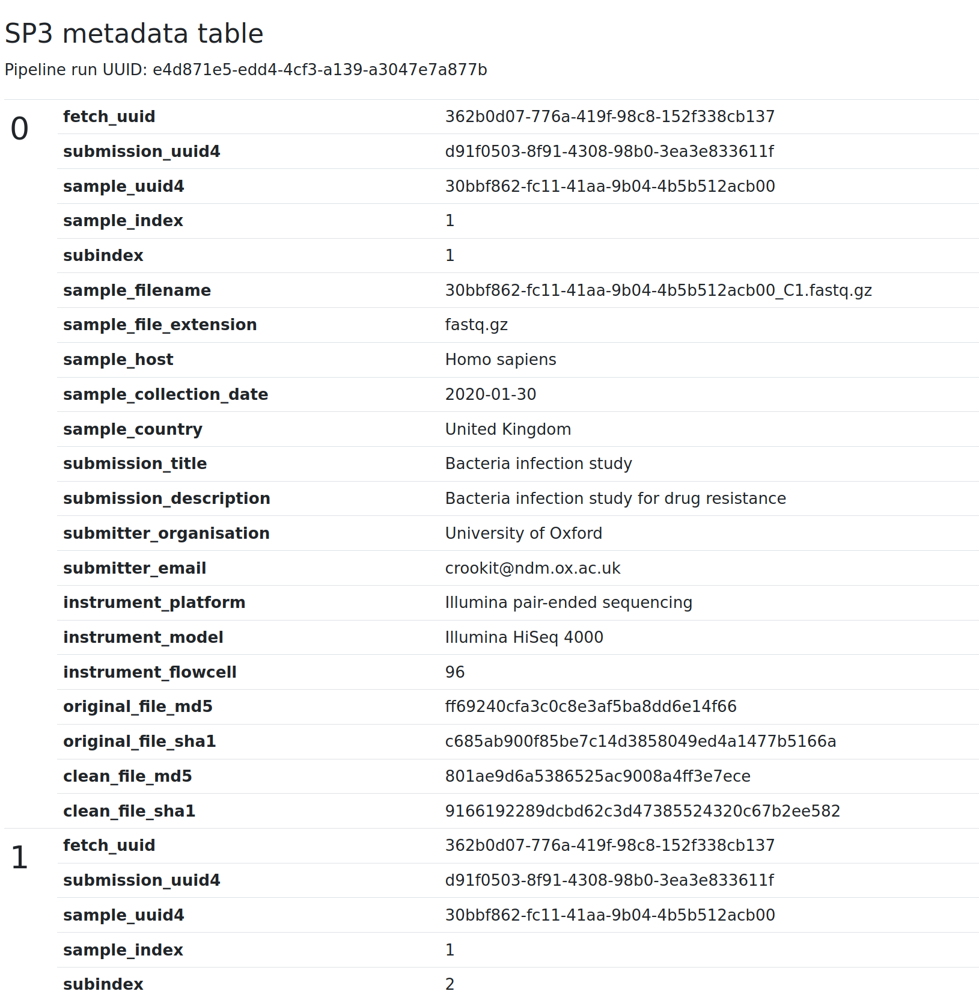

And there are more, and please proceed with caution.

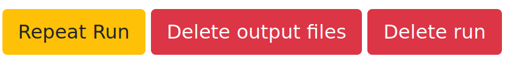

Repeat Run
----------

If you like to repeat a run, use this feature. SP3 will pre-fill everything for you as your last run.
This is helpful when you like to change some parameters and run against the same dataset.

Delete output files
-------------------

If you don't like us to archive your output files (save to the persistent storage), you can choose to delete them.

Delete run
----------

This will delete the run and nothing will be saved for the run, the logs, the output, the reports etc.
The dataset will not be deleted, you can run again.
This is helpful if your run has errors and no need to keep them.
