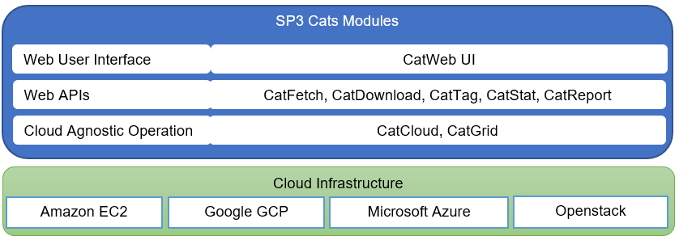

Modules
=======

SP3 has taken a clear modular design approach. Each module has its single and independent responsibility, performing one aspect of the designed functionality. 

All modules are working together in three layers, UI, APIs and Cloud. All modules are written in Python3.6+ and prefix with Cat*, with a wish to be agile and flexible.

CatWeb is a web user interface that calls web API modules for different functionalities. CatGrid and CatCloud provide a unified layer for cloud agnostic compute node scaling and job scheduling. 

CatWeb UI
---------

CatWeb UI is a web user interface that allows user to interact with SP3, for fetching data, analysing samples on different pipelines, monitoring the progress and download the result. 

CatWeb API
----------

CatWeb API is a web API that provides endpoints for fetching data, analysing samples on different pipelines, monitoring the progress and download the result.

CatFetch API
------------

CatFetch is a web API that downloads data from different data sources, like ENA or other sources.

CatDownload API
---------------

CatDownload is a web API that provides URL of files to be downloaded.

CatStat API
-----------

CatStats collects state of the CatGrid, and draws graphs based on the CatGrid state, it serves a single svg graph as a Web API.

CatTag API
----------

CatTag is a web API that provides tagging features for runs and samples.

CatReport API
-------------

Catreport is a service that takes requests for reporting, generating reports and serving them on the web. 

For example, a clockwork pipeline has a report generated by Catreport for its output on Kraken2, Mykrobe, Samtool QC and drug resistance prediction.

CatGrid API
-----------

Catgrid is a configurationless, agentless grid scheduler with a web api. It manages nodes and jobs. It accepts web API request for nodes adding, removing and jobs scheduling.

CatGrid implements similar interface as Slurm cluster, such as sbatch, squeue and sbatch.

CatCloud
--------

CatCloud is a python application that performs cloud compute nodes scaling. It manages vms on different cloud infrastructure in a configurable fashion.

CatCloud can with CatGrid or Slurm Cluster.