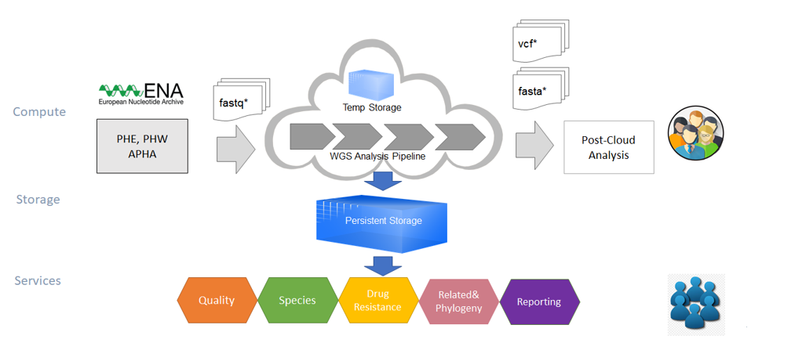

Overview
========

The Scalable Pathogen Pipeline Platform (SP3) is a cloud compute solution developed by `Oxford MMM group <http://modmedmicro.nsms.ox.ac.uk/>`_ for pathogen genomic analysis in the cloud.

SP3 provides an efficient and unified process of collecting, analysing and comparing genomic data analysis with the benefit of elastic cloud computing. SP3 enables container-centric bioinformatic workflows run on personal computers, High-performance computing (HPC) clusters and cloud platforms. SP3 has been deployed and tested on Google Cloud Platform (GCP), Microsoft Azure Cloud, Amazon Elastic Compute Cloud (Amazon EC2) and OpenStack Platforms. 

SP3 allows users to fetch genomic sequencing data from European Nucleotide Archive (ENA) and other ad-hoc sources and conduct analysis with open-source bioinformatic pipelines.

User Journey
------------

.. image:: _static/flow.png

Log in
------

The user selects which SP3 cloud instance to use and logs in.

Fetch Data
----------
.. image:: _static/fetch.png

**From ENA**

If the genomic data that the user wishes to analyze is hosted on the ENA, SP3 can fetch it directly. The user goes to the Dataset page, clicks New Fetch, inputs the project accession and the samples to fetch and clicks New Fetch. The data is fetched from the ENA in the background and the progress can be monitored on the dataset page.

**From Other Source**

Sequence files can be transferred to the cloud server, then SP3 can fetch it from a folder. The users goes to the Dataset page, clickes New Fetch, choose LOCAL as source, and provide the folder of the data. The data is fetched from the local folder, which takes a few seconds to be ready for analysis.

Start a pipeline
----------------

Once the dataset is fetched, the user can start a new analysis by going to the Datasets page, selecting a pipeline, and clicking Run on the dataset they wish to run the analysis on. This takes them to the New Run page where they select the settings specific to this analysis pipeline. Once they submit the run, they are taken to the pipeline status page where they can monitor the progress of the run.

Monitor the Progress
--------------------

.. image:: _static/monitor.png

On the pipeline status screen, the user can click the details link to go to the run details link. This allows the user to view the nextflow log, to stop the run, view the progress per-sample and view the commands run and their output for each nextflow task. When the run is finished, the user can view the Nextflow report, the timeline, repeat the run or fetch the output as a new dataset. The details of the cluster compute can also the viewed on the Compute page, providing information on the nodes that are active, disk space status, what tasks are running on which nodes and an activity graph covering the past 24 hours.

View the report
---------------

If the pipeline has an associated report, it can be viewed at the run details page by clicking on the sample name.

