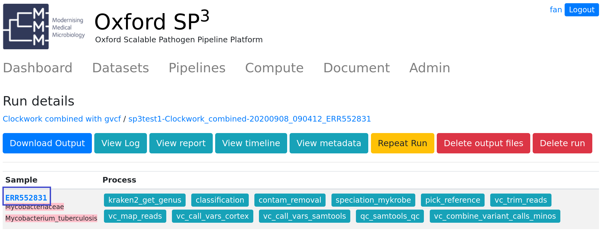
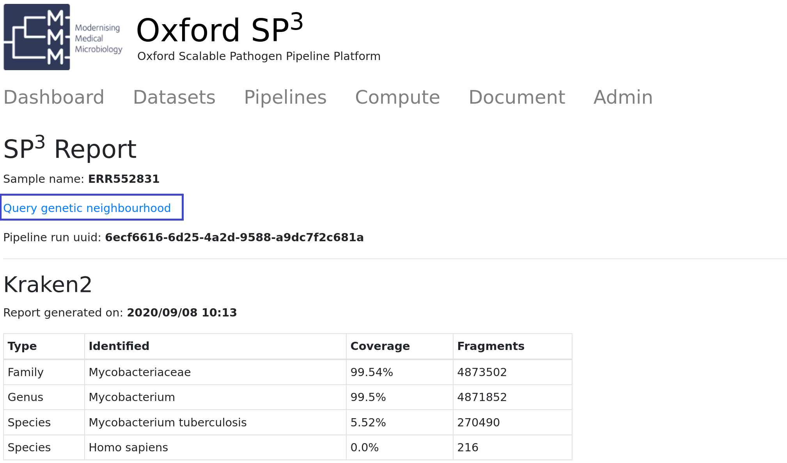
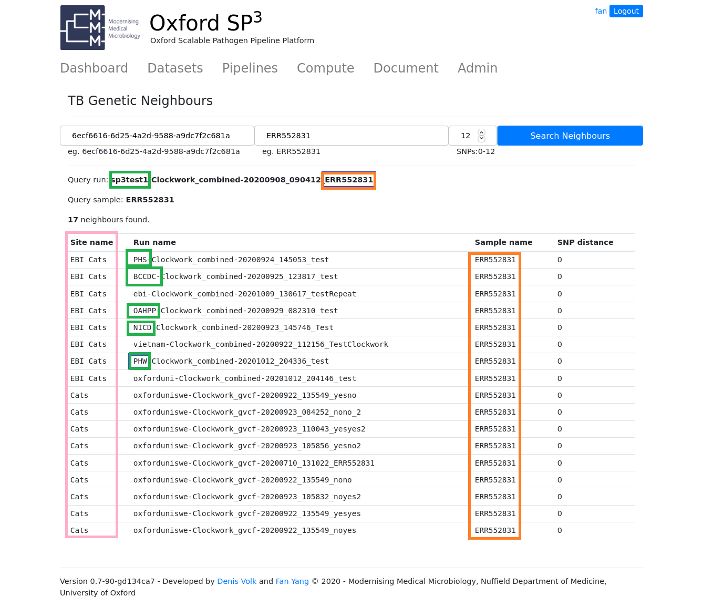
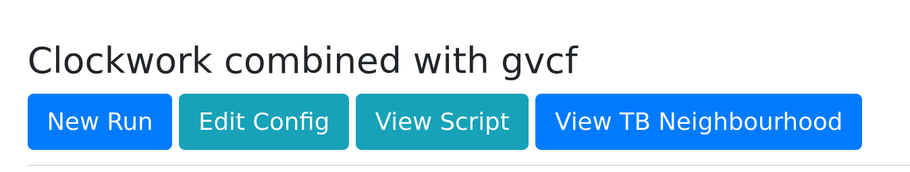
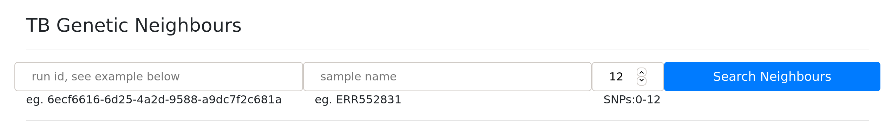

Pipelines
=========

Overview
--------

+-------------------------+----------------------------------------+---------------------------------------------------+------------------+
| Pipeline                |     Species                            |       Features and Repo                           |      Author      |
+=========================+========================================+===================================================+==================+
| Oxford Catbug           |    TB + NTM                            |    - Speciation (Kraken2 + Mykrobe)               |    Denis Volk    |
|                         |                                        |    - Clockwork (for TB)                           |                  |
|                         |                                        |    - Compass (for NTM)                            |                  |
|                         |                                        |    - Drug Resistance on Clockwork VCF             |                  |
+-------------------------+----------------------------------------+---------------------------------------------------+------------------+
| Clockwork VC            |    TB                                  |    https://github.com/iqbal-lab-org/clockwork     |   Martin Hunt    |
+-------------------------+----------------------------------------+---------------------------------------------------+------------------+
| Clockwork TB Only       |    TB                                  |    - Speciation (Kraken2 + Mykrobe)               |                  |
|                         |                                        |    - Clockwork VC                                 |    Denis Volk    |
|                         |                                        |    - Drug Resistance                              |                  |
+-------------------------+----------------------------------------+---------------------------------------------------+------------------+
| Oxford CompassCompact   |    TB + NTM                            |    https://github.com/oxfordmmm/CompassCompact    |    Yifei & Fan   |
|                         |                                        |                                                   |                  |
+-------------------------+----------------------------------------+---------------------------------------------------+------------------+
| Oxford CompassPlus      |    TB + NTM                            |    - Speciation (Kraken2 + Mykrobe)               |    Denis & Fan   |
|                         |                                        |    - CompassCompact                               |                  |
+-------------------------+----------------------------------------+---------------------------------------------------+------------------+
| PHE Flu                 |    Flu Virus                           |                                                   |    Ulf & Denis   |
+-------------------------+----------------------------------------+---------------------------------------------------+------------------+
| APHA BTB                |    Bovine TB                           |   https://github.com/oxfordmmm/BovTB-nf-docker    |  Richard & Fan   |
+-------------------------+----------------------------------------+---------------------------------------------------+------------------+
| Oxford Bug Flow         |    Bacteria                            |   https://github.com/davideyre/bug-flow           |    David Eyre    |
+-------------------------+----------------------------------------+---------------------------------------------------+------------------+

TB Pipelines
------------

+--------------+----------+----------+------------+----------+----------+----------+----------+----------+-----------+----------+----------+------------+----------+
|pipleine      |input     |kraken2   |removecontam|mykrobe   |auto pick |trim      |bwa map   |samtool   | samtoolqc |  cortex  |  minos   |  fasta     |resistance|
|              |          |          |            |          |reference |          |          |mpileup   |           |          |          |            |          |
|              |          |          |            |          |          |          |          |          |           |          |          |            |          |
+==============+==========+==========+============+==========+==========+==========+==========+==========+===========+==========+==========+============+==========+
|catbug        |fastq/bam |Y         |Y           |Y         |Y         |Y         |Y         |Y         |Y          |Y         |Y         |Y           |Y         |
|tb            |          |          |            |          |          |          |          |          |           |          |          |            |          |
+--------------+----------+----------+------------+----------+----------+----------+----------+----------+-----------+----------+----------+------------+----------+
|catbug        |fastq/bam |Y         |Y           |Y         |Y         |Y         |Y         |Y         |Y          |          |          |Y           |          |
|non-tb        |          |          |            |          |          |          |          |          |           |          |          |            |          |
+--------------+----------+----------+------------+----------+----------+----------+----------+----------+-----------+----------+----------+------------+----------+
|clockwork     |fastq/bam |Y         |Y           |Y         |Y         |Y         |Y         |Y         |Y          |Y         |Y         |Y           |Y         |
|tb            |          |          |            |          |          |          |          |          |           |          |          |            |          |
+--------------+----------+----------+------------+----------+----------+----------+----------+----------+-----------+----------+----------+------------+----------+
|CompassCompact|fastq/bam |          |            |          |          |          |Y         |Y         |Y          |          |          |Y           |          |
|              |          |          |            |          |          |          |          |          |           |          |          |            |          |
+--------------+----------+----------+------------+----------+----------+----------+----------+----------+-----------+----------+----------+------------+----------+
|Clockwork VC  |fastq     |          |            |          |          |Y         |Y         |Y         |Y          |Y         |Y         |            |          |
|              |          |          |            |          |          |          |          |          |           |          |          |            |          |
+--------------+----------+----------+------------+----------+----------+----------+----------+----------+-----------+----------+----------+------------+----------+

TB Neighbourhood (alpha release)
--------------------------------

For clockwork TB pipeline, we have a service built for examining genetic neighbourhood based on SNP distance. 

To see genetic related samples, a sample would have been through following processes:

1. The sample has been succesfully run in **clockwork** pipeline.
2. The sample has been identified by mykrobe as **mycobacterium tuberculosis**.
3. The sample has been succesfully mapped to reference **NC_000962.3**.
4. The sample has been archived to Sp3 persistence storage. (This is currently done manually.)
5. The sample has been pushed to TB neighbourhood service, catwalk. (This is currently done manually.)

With alpha release, you would not see neighbourhood right after the run as the step 4 and step 5 would be run manually at the moment. The step 4 and step 5 would be done at the end of the day or end of the week, so please check it later.

If you have a sample that has been through all the above processes, here is how to see the genetic neighbours.

**Step 1**. Click the sample name to view SP3 report, from a complete run, eg. click **ERR552831** as shown below.

**Step 2**. Click link "Query genetic neighbourhood" at the top of the SP3 report below the sample name.

**Step 3**. Genetic neighbourhood page would show you the result. In the example below, there were **17** neighbours found shown in a neighbourhood table.

Among all 17 genetic related samples, there are 8 samples run from **EBI Cats** site and the rest from **Cats** site (staging/test site).

The run name of the neighour samples (with a prefix of organisation) gives a hint on the source of the neighbours, the organisation, such as PHS, PHW, OAHPP etc.

And the sample names of the neighbours are also shown at the 3rd column of the table.

The last column of the neightbour table is the SNP distance, to the query sample. You might notice, in this case, SNP distances are all shown as Zero. This is because the same sample has been run in all different organisations.

You can also query genetic neighbours ad-hoc in an interactive way, go to "clockwork" pipeline and click "View TB Neighbourhood"

Follow the hint, use a run id and a sample name and set a SNP distance for the query.

