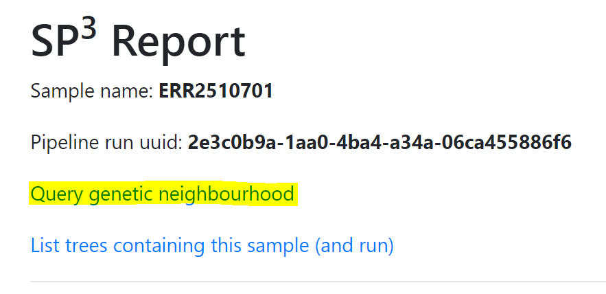
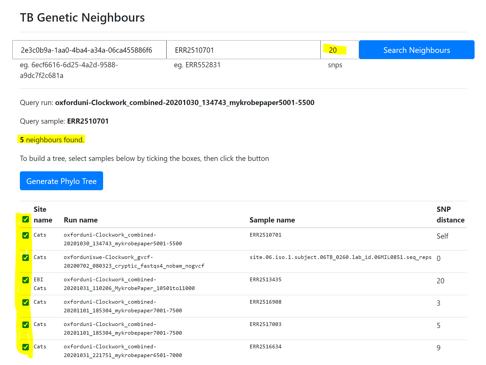
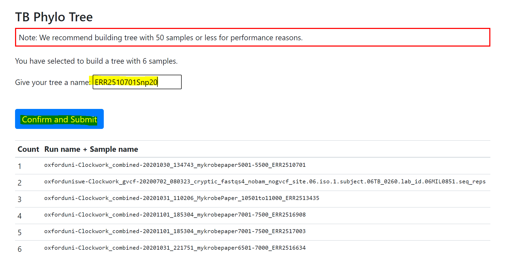
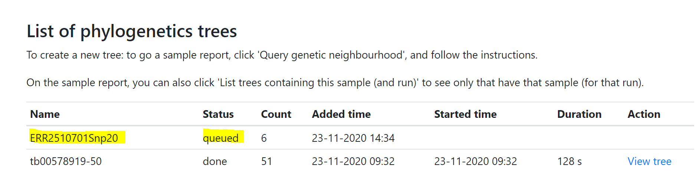
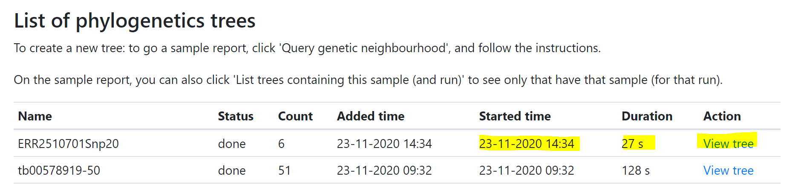
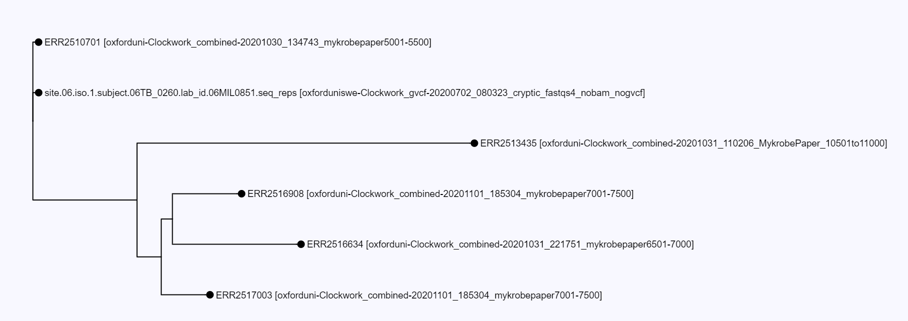
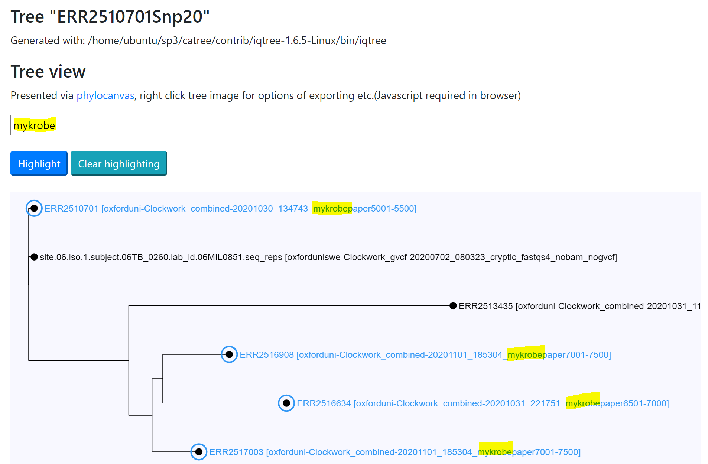

Pipelines
=========

Overview
--------

+-------------------------+----------------------------------------+---------------------------------------------------+------------------+
| Pipeline                |     Species                            |       Features and Repo                           |      Author      |
+=========================+========================================+===================================================+==================+
| Clockwork combined      |    TB + NTM                            |    - Speciation (Kraken2 + Mykrobe)               |   Denis & Fan    |
|                         |                                        |    - Clockwork (for TB)                           |                  |
|                         |                                        |    - Drug Resistance on Clockwork VCF             |                  |
|                         |                                        |    - TB Neighbourhood and Phylogeny Trees         |                  |
+-------------------------+----------------------------------------+---------------------------------------------------+------------------+
| Clockwork VC            |    TB                                  |    https://github.com/iqbal-lab-org/clockwork     |   Martin Hunt    |
+-------------------------+----------------------------------------+---------------------------------------------------+------------------+
| Oxford CompassCompact   |    TB + NTM                            |    https://github.com/oxfordmmm/CompassCompact    |    Yifei & Fan   |
|                         |                                        |                                                   |                  |
+-------------------------+----------------------------------------+---------------------------------------------------+------------------+
| APHA BTB                |    Bovine TB                           |   https://github.com/oxfordmmm/BovTB-nf-docker    |  Richard & Fan   |
+-------------------------+----------------------------------------+---------------------------------------------------+------------------+
| Oxford Bug Flow         |    Bacteria                            |   https://github.com/davideyre/bug-flow           |    David Eyre    |
+-------------------------+----------------------------------------+---------------------------------------------------+------------------+

TB Pipelines
------------

+--------------+----------+----------+------------+----------+----------+----------+----------+----------+-----------+----------+----------+------------+----------+
|pipleine      |input     |kraken2   |removecontam|mykrobe   |auto pick |trim      |bwa map   |samtool   | samtoolqc |  cortex  |  minos   |  fasta     |resistance|
|              |          |          |            |          |reference |          |          |mpileup   |           |          |          |            |          |
|              |          |          |            |          |          |          |          |          |           |          |          |            |          |
+==============+==========+==========+============+==========+==========+==========+==========+==========+===========+==========+==========+============+==========+
|catbug        |fastq/bam |Y         |Y           |Y         |Y         |Y         |Y         |Y         |Y          |Y         |Y         |Y           |Y         |
|tb            |          |          |            |          |          |          |          |          |           |          |          |            |          |
+--------------+----------+----------+------------+----------+----------+----------+----------+----------+-----------+----------+----------+------------+----------+
|catbug        |fastq/bam |Y         |Y           |Y         |Y         |Y         |Y         |Y         |Y          |          |          |Y           |          |
|non-tb        |          |          |            |          |          |          |          |          |           |          |          |            |          |
+--------------+----------+----------+------------+----------+----------+----------+----------+----------+-----------+----------+----------+------------+----------+
|clockwork     |fastq/bam |Y         |Y           |Y         |Y         |Y         |Y         |Y         |Y          |Y         |Y         |Y           |Y         |
|tb            |          |          |            |          |          |          |          |          |           |          |          |            |          |
+--------------+----------+----------+------------+----------+----------+----------+----------+----------+-----------+----------+----------+------------+----------+
|CompassCompact|fastq/bam |          |            |          |          |          |Y         |Y         |Y          |          |          |Y           |          |
|              |          |          |            |          |          |          |          |          |           |          |          |            |          |
+--------------+----------+----------+------------+----------+----------+----------+----------+----------+-----------+----------+----------+------------+----------+
|Clockwork VC  |fastq     |          |            |          |          |Y         |Y         |Y         |Y          |Y         |Y         |            |          |
|              |          |          |            |          |          |          |          |          |           |          |          |            |          |
+--------------+----------+----------+------------+----------+----------+----------+----------+----------+-----------+----------+----------+------------+----------+

TB Neighbourhood (alpha release)
--------------------------------

For clockwork TB pipeline, we have a service built for examining genetic neighbourhood based on SNP distance. 

To see genetic related samples, a sample would have been through following processes:

1. The sample has been succesfully run in **clockwork** pipeline.
2. The sample has been identified by mykrobe as **mycobacterium tuberculosis**.
3. The sample has been succesfully mapped to reference **NC_000962.3**.
4. The sample has been archived to Sp3 persistence storage. (This is currently done manually.)
5. The sample has been pushed to TB neighbourhood service, catwalk. (This is currently done manually.)

With alpha release, you would not see neighbourhood right after the run as the step 4 and step 5 would be run manually at the moment. The step 4 and step 5 would be done at the end of the day or end of the week, so please check it later.

If you have a sample that has been through all the above processes, here is how to see the genetic neighbours.

Step 1
^^^^^^
 
Click the sample name to view SP3 report, from a complete run, eg. click **ERR552831** as shown below.

.. image:: _static/neighbour11.png

Step 2 
^^^^^^

Click link "Query genetic neighbourhood" at the top of the SP3 report below the sample name.

.. image:: _static/neighbour22.png

Step 3 (with new features)
^^^^^^^^^^^^^^^^^^^^^^^^^^

Genetic neighbourhood page would show you the result. In the example below, there were **2** neighbours found shown in a neighbourhood table.

These two neighbours are from **EBI Cats** site (other sites samples could be detected if there are any).

The run name of the neighour samples (with a prefix of organisation) gives a hint on the source of the neighbours, in this case, **oxforduni**.

And the sample names of the neighbours are also shown at the 3rd column of the table.

The last column of the neightbour table is the SNP distance, to the query sample. 

.. image:: _static/neighbour33.png

1. There will be no **duplicate** samples among neighbours. (although there might be one sample same name as the query sample)
2. Quick select for samples from your **own** organisation. (e.g. in the example, select samples prefixed as "sp3test1")
3. Quick select for samples from **other** organisations. (e.g. in the sample, select samples prefixed other than "sp3test1")
4. You can always select and unselect all samples using the checkbox near "Site name". 
5. You have to select **3** or **more** samples to build a tree.

You can also query genetic neighbours ad-hoc in an interactive way, go to "clockwork" pipeline and click "View TB Neighbourhood"

.. image:: _static/viewTB.png

Follow the hint, use a run id and a sample name and set a SNP distance for the query.

.. image:: _static/neighbour.png 
        :align: left   
        :height: 120pt

TB Phylogeny
------------

For TB Neighbourhood, we build phylogeny trees for the nearest neighbourhood of TB samples.

To create a tree for your sample and its neighbours: 

Step 1. Query neighbours
^^^^^^^^^^^^^^^^^^^^^^^^

At SP3 sample report page, click 'Query genetic neighbourhood'.

Step 2. Select and generate
^^^^^^^^^^^^^^^^^^^^^^^^^^^

Select the samples among the neighbours, and build the tree.

You can adjust SNP distance, and select all or part of the neighbours to build trees.

Step 3. Confirm and name the tree
^^^^^^^^^^^^^^^^^^^^^^^^^^^^^^^^^

Confirm your selection, and provide a name for your tree for later reference. Then click the button to generate the tree.

Step 4. Monitor the queue
^^^^^^^^^^^^^^^^^^^^^^^^^

The tree buildling could be compute intensive and it could take a while. 

After tree building job is submitted, you would be able to see your tree job is queued to compute.

You can refresh the page, until it completes. It could be seconds, or minutes or hours depending on the amount of the nodes.

Step 5. View the tree
^^^^^^^^^^^^^^^^^^^^^

When completed, the tree can be viewed in a page. (This uses phylocanvas, so javascript needs to be allowed in the browser.)

In this page, one or more nodes can be highlighted, given a search text in the node label.

You can use more features of Phylocanvas, by right click on the tree, such as:

    - Export leave labels, newick file and tree image
    - Show or hide labels
    - Align/Realign labels

You can also zoom or pan the image or click on node to highlight or clear the highlight.
