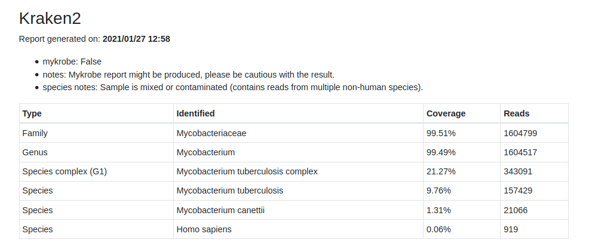
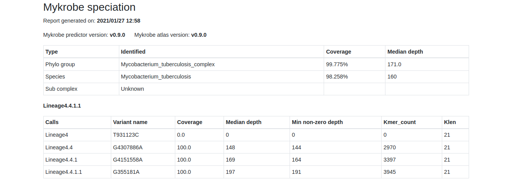
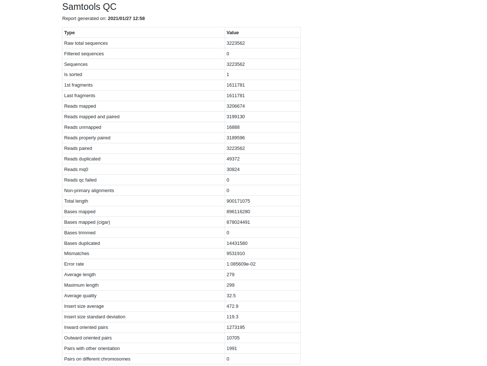
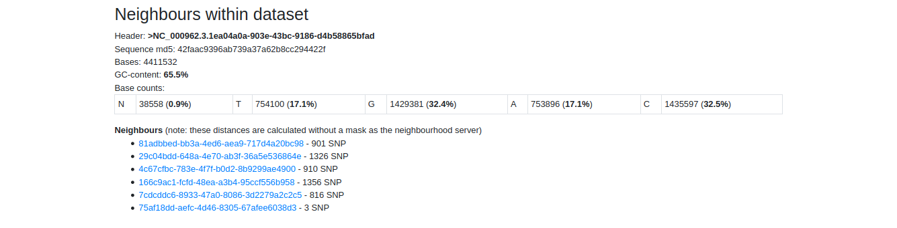

Reporting
=========

Kraken2
-------

**Example of Kraken2 report**

Kraken2 is used to classify reads according to their most likely taxonomic clade.

More: `speciation documentation <https://github.com/oxfordmmm/speciation>`_

Kraken2 DB: `MiniKraken2_v2_8GB <https://ccb.jhu.edu/software/kraken2/downloads.shtml>`_ 

See `how kraken output is parsed. <https://github.com/oxfordmmm/speciation>`_

Mykrobe Speciation
------------------
**Example of Mykrobe report**

Mykrobe is used to further classification if the sample appear to be mycobacterial, or a mixture containing M. tuberculosis reads.

Mykrobe tests for the presence of probe sequences in the reads to determine the species present. 

The “Coverage” is the percent of the probe that has non-zero read depth. “Median depth” is the median read depth across the probe.

See `mykrobe documentation <https://github.com/oxfordmmm/speciation>`_

See `SNP panel for lineage classification <http://tgu.ibv.csic.es/?page_id=1794>`_

See `how mykrobe output is parsed. <https://github.com/oxfordmmm/speciation>`_

Reference
---------
**Example of Reference report**

Reference is selected based on mykrobe result. 

There are currently 10 available, with associated RefSeq chromosome IDs as follows:

* Mycobacterium abscessus --> NC_010397.1
* Mycobacterium africanum --> NC_000962.3
* Mycobacterium avium --> NC_002944.2
* Mycobacterium bovis --> NC_002945.4
* Mycobacterium chelonae --> NZ_CP007220.1
* Mycobacterium chimaera --> NZ_CP012885.2
* Mycobacterium fortuitum --> NZ_CP011269.1
* Mycobacterium intracellulare --> NC_016946.1
* Mycobacterium kansasii --> NC_022663.1
* Mycobacterium tuberculosis --> NC_000962.3

Samtools QC
-----------
**Example of QC report**

See `Samtools documentation <http://www.htslib.org/doc/samtools-stats.html>`_

Resistance
----------
**Example of drug resistance report**

.. image:: _static/report_resistance.png

Proceed only if M. tuberculosus:

* First a Genome object of the M. tuberculosis reference (NC_000962.3) is created/loaded (`reference`) using `gumpy`
* It is then copied for the `sample`
* The per-sample VCF produced by Clockwork is consumed and applied to the `sample` Genome object.
* `gumpy <https://github.com/oxfordmmm/gumpy>`_ methods then produce lists of the genetic variants and mutations between `reference` and `sample`.
* These are then parsed by the `piezo <https://github.com/oxfordmmm/piezo>`_ package which in turn requires a resistance catalogue stored using a standard grammar (GARC). Some published catalogues are available `here <https://github.com/oxfordmmm/tuberculosis_amr_catalogues>`_ (others will be added over time, including the Seq&Treat/WHO catalogue and any resulting from CRyPTIC).

Resistance configuration
^^^^^^^^^^^^^^^^^^^^^^^^
* The antibiogram is then output for the drugs contained in the specified catalogue.
* Also calculated and stored, but not shown in the report at present, are the effects (R/S/U) on each drug of each relevant mutation, allowing one to, for example, understand what mutation was responsible for a specific drug being predicted to be resistant.

Drugs
^^^^^
Which drugs are considered depends on which tuberculosis AMR catalogue was specified.

Mutations
^^^^^^^^^
`gumpy` produces two hierarchies of genetic variant. The lower-level description contains all insertions/deletions and all single nucleotide polymorphisms (SNP) -- we call these *genetic variants*. The higher-level description (which is typically used in resistance prediction) translates the latter into amino acids, if they lie within the coding region of a protein gene, otherwise there is no change. We describe these as *mutations*. Because more than SNP can occur in a codon, the latter tends to 

Neighbours
----------
**Example of SNP distance report**

SNP distance is calculated for a sample against other samples in the same run.