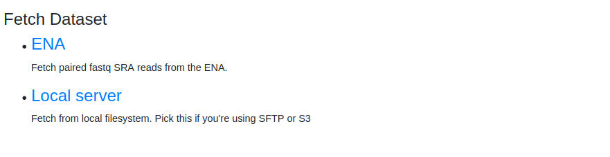

.. _user-guide:

User Guide
==========

Welcome to use Oxford SP3. Please take a moment to view this user guide and consider the options available to you before you start.

Register an account
-------------------

To register with SP3, please send an email to crookcs.it@ndm.ox.ac.uk with a subject as "**SP3 User Registration**" and provide following information: 

* Your email
* Your full name
* Your organisation
* Your group (if you know)
* Your research summary related to SP3
* How often do you expect to use SP3?
* How many samples do you expect to submit to SP3?
* Which way would you submit your data to SP3? (see below choice)
* Any other information you like us to know.

User, group and storage
-----------------------
To use Oxford SP3, a user needs to register an SP3 **account**. The account allows you to log into one of our SP3 cloud platforms for pathogen sequencing data analysis.

When register, we will assign you to a **group**. SP3 uses group to manage data access and privacy. All users of one group can share data and pipelines. This means a user in one group can see all the analysis run by another user in the same group.

A group can be a physical organisation or a virtual organisation. For example, Oxford University can have two groups, one for TB research, one for virus research.

If your group has a cloud **storage**, say a S3 bucket, your sequencing data can be uploaded to that bucket and SP3 can get data from there if you allow us to do so. Only users from your organisation can see your sequencing data.

SP3 can also get data from ENA via study number, project number or sample assession number.

You can find more about SP3 :ref:`data-type`.

You can find more about SP3 :ref:`data-storage`.

Data fetching
-------------

To run analysis in SP3, we first fetch data to SP3 from two sources: ENA or SP3 local.

1. If you know assession number of ENA dataset, you can fetch ENA data to SP3.

.. image:: _static/fetch_ena.png

This is data available to public and uploaded to ENA via `ENA <https://www.ebi.ac.uk/ena/submit>`_.

2. From SP3 Local (where files are uploaded to SP3 via web upload or SP3 submission module, i.e. CatsUp)

.. image:: _static/fetch_local.png

Data uploading
--------------

To fetch files from SP3 local, files need to be uploaded before fetching, use one of following method:

+----------------+---------------------------------------------------+-------------------------+-------------------------------------------------+
|                |            Tools                                  |    Meta-data required   |       Access Control                            |
+----------------+---------------------------------------------------+-------------------------+-------------------------------------------------+
| SP3 submission | `CatsUp <https://github.com/oxfordmmm/catsup>`_   |           Yes           |  Available within organisation                  |
+----------------+---------------------------------------------------+-------------------------+-------------------------------------------------+
| Web upload     | SP3 site (see blow)                               |           No            |  Available only to the user who uploads data.   |
+----------------+---------------------------------------------------+-------------------------+-------------------------------------------------+

To use web upload, go to "Datasets"

.. image:: _static/dataset.png

Then select "Upload Datasets"

.. image:: _static/upload.png
