.. _user-guide:

User Guide
==========

Welcome to use Oxford SP3. Please take a moment to view this user guide and consider the options available to you before you start.

User, group and storage
-----------------------
To use Oxford SP3, a user needs to register an SP3 **account**. The account allows you to log into one of our SP3 cloud platforms for pathogen sequencing data analysis.

When register, we will assign you to a **group**. SP3 uses group to manage data access and privacy. All users of one group can share data and pipelines. This means a user in one group can see all the analysis run by another user in the same group.

A group can be a physical organisation or a virtual organisation. For example, Oxford University can have two groups, one for TB research, one for virus research.

If your group has a cloud **storage**, say a S3 bucket, your sequencing data can be uploaded to that bucket and SP3 can get data from there if you allow us to do so. Only users from your organisation can see your sequencing data.

SP3 can also get data from ENA via study number, project number or sample accession number.

You can find more about SP3 :ref:`data-type`.

You can find more about SP3 :ref:`data-storage`.

Register an account
-------------------

To register with SP3, please click `Register <https://sp3ebi.mmmoxford.uk/register_sp3_user>`_. When your account is activated, you will receive an email.

User Journey
------------

With your SP3 account activated, you can start! A simple user journey is shown as follows.

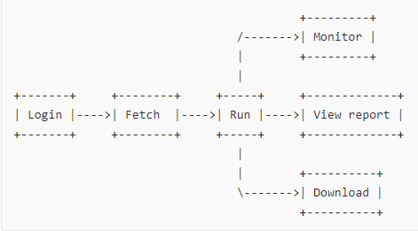

Log in
------

User selects which SP3 cloud instance to use and logs in.

Fetch Data
----------
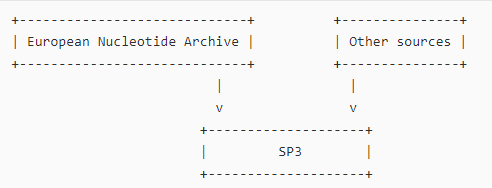

There are three options for user to fetch data, two options for ENA, one option for local data storage. Local storage has data from web upload or S3 buckets via catsup module.

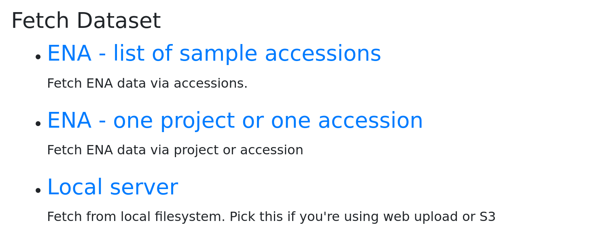

**From ENA**

If the genomic data is hosted at the ENA repo, SP3 can fetch it directly. Please go to Dataset page, click New Fetch.

You can fetch one project, one accession or a list of accessions.
    
    Option 1. One project or one accession.

    Option 2. A list of accessions from multiple project.

Remember one fetch would make a dataset for one run. That means if you provdie a list of 200 samples, those 200 samples would be in one batch to run. We recommend maximum 500 samples/accessions for one run.

1. Download all accessions from one project or one accession, you can fetch ENA data as following.

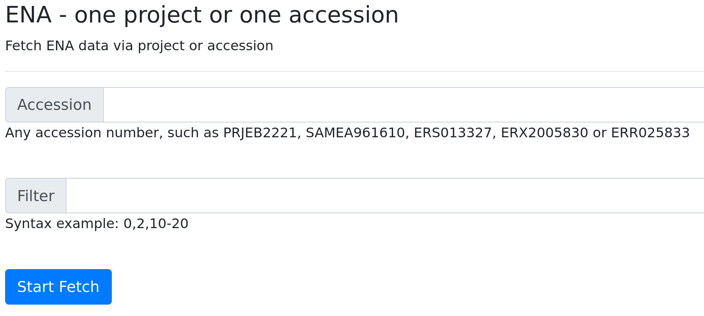

2. If you have a list of accessions, fetch as following.

*Step 1:* Choose option - ENA - list of sample accessions

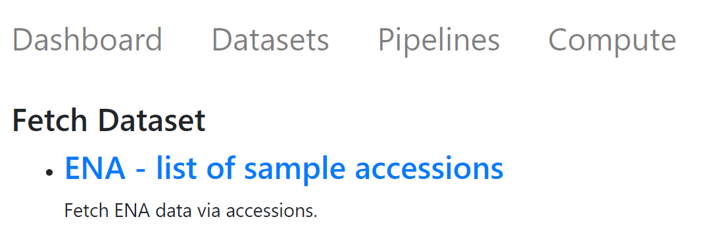

*Step 2:* Copy and paste a list of accession numbers, there is a "fetch name" generated for you and you can edit it to make it easier to identify.  

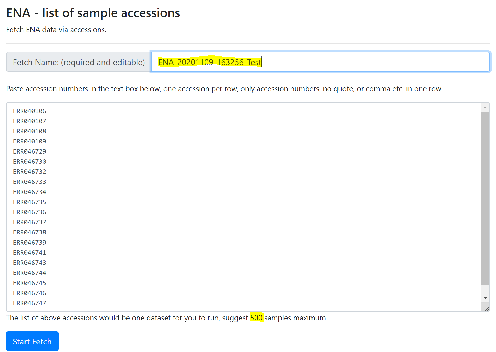

*Step 3:* Your dataset would be added to the queue and have a coffee break, while waiting for the download.
The data is fetched from the ENA in the background and the progress can be monitored on the dataset page.

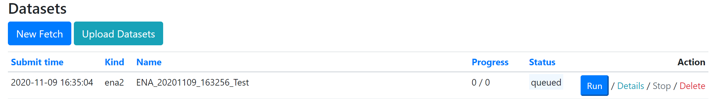

*Step 4:* Refresh the dataset page, your would see a *success* if all goes well. 

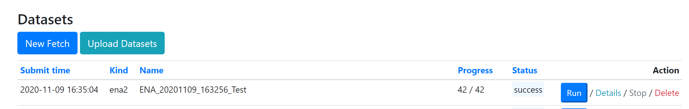

**From Other Source**

Sequence files can be transferred to the cloud server, then SP3 can fetch it from a folder. The users goes to the Dataset page, clickes New Fetch, choose LOCAL as source, and provide the folder of the data. The data is fetched from the local folder, which takes a few seconds to be ready for analysis.

1. From SP3 Local (where files are uploaded to SP3 via web upload or SP3 submission module, i.e. CatsUp)

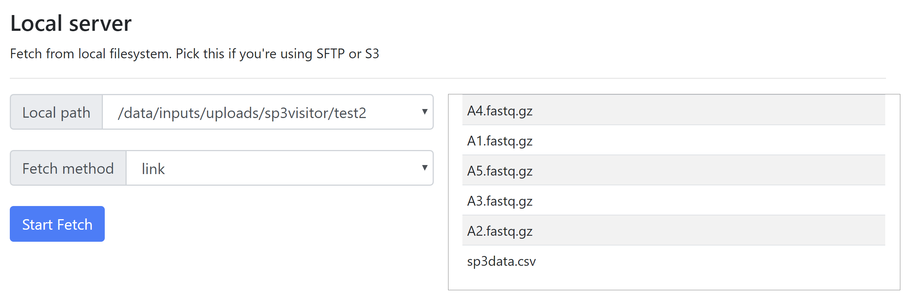

Data uploading
--------------

To fetch files from SP3 local, files need to be uploaded before fetching, use one of following method:

+----------------+---------------------------------------------------+-------------------------+-------------------------------------------------+
|                |            Tools                                  |    Meta-data required   |       Access Control                            |
+----------------+---------------------------------------------------+-------------------------+-------------------------------------------------+
| SP3 submission | `CatsUp <https://github.com/oxfordmmm/catsup>`_   |           Yes           |  Available within organisation                  |
+----------------+---------------------------------------------------+-------------------------+-------------------------------------------------+
| Web upload     | SP3 site (see blow)                               |           No            |  Available only to the user who uploads data.   |
+----------------+---------------------------------------------------+-------------------------+-------------------------------------------------+

To use web upload, go to "Datasets"

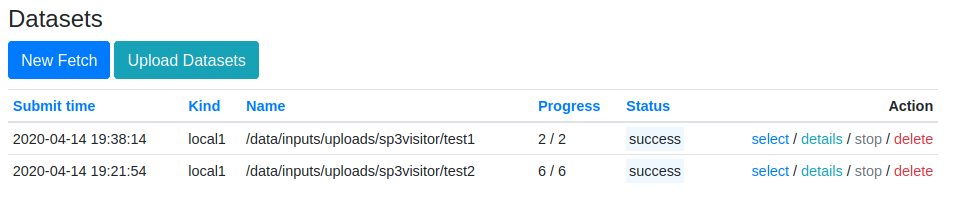

Then select "Upload Datasets"

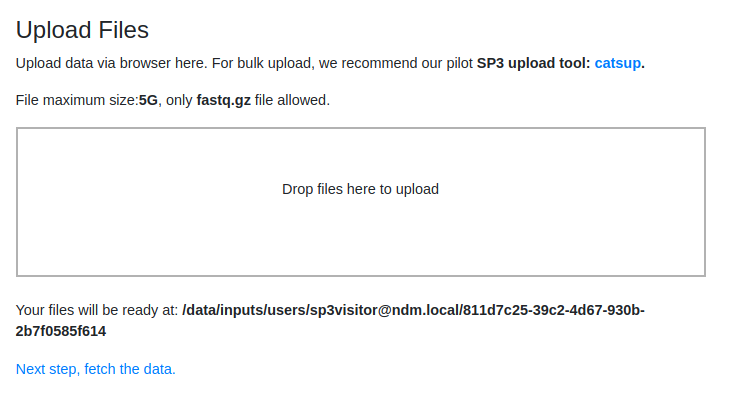

Run a pipeline
----------------

Once the dataset is fetched, the user can start a new analysis by going to the Datasets page, selecting a pipeline, and clicking Run on the dataset they wish to run the analysis on. This takes them to the New Run page where they select the settings specific to this analysis pipeline. Once they submit the run, they are taken to the pipeline status page where they can monitor the progress of the run.

Monitor the progress
--------------------

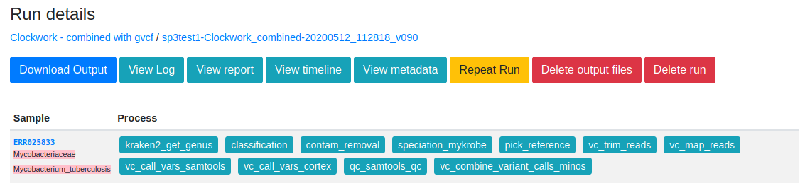

On the pipeline status screen, the user can click the details link to go to the run details link. This allows the user to view the nextflow log, to stop the run, view the progress per-sample and view the commands run and their output for each nextflow task. When the run is finished, the user can view the Nextflow report, the timeline, repeat the run or fetch the output as a new dataset. The details of the cluster compute can also the viewed on the Compute page, providing information on the nodes that are active, disk space status, what tasks are running on which nodes and an activity graph covering the past 24 hours.

View SP3 report
---------------

If the pipeline has an associated report, it can be viewed at the run details page by clicking on the sample name.

.. image:: _static/ERR025833.png

Download the output files
-------------------------

All output files are avaialbe for download via a command or via web. 

Click the **download link**, you will be able to explore the output files and download any of them.

You can also use the **wget** command shown to get all output files for your run. 

There is a filter option **(-A)** to help you only download a special type of files, see examples below. 

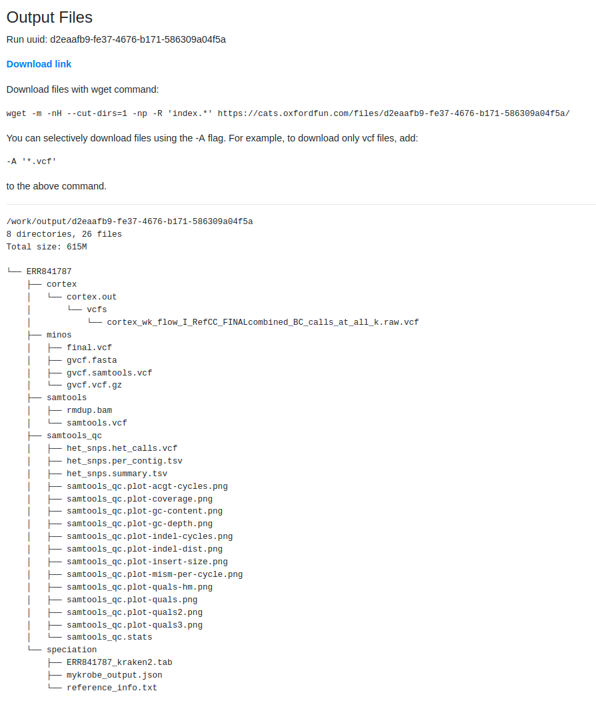

Explore more :ref:`sp3-features`.
